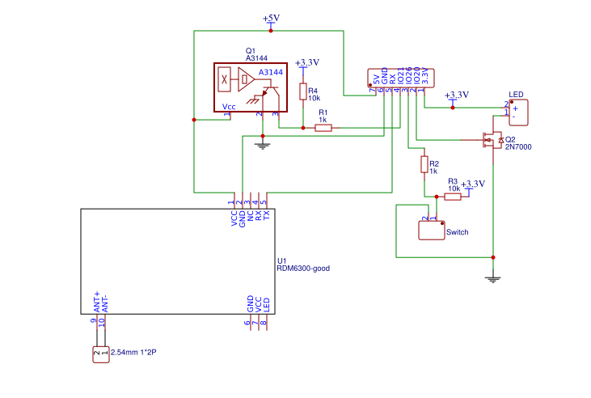

# Hardware

* 1 x Raspberry Pi (3 preferably)
* 1 x Arcade button (Switch + LED)
* 1 x Hall Effect Switch
* 1 x Serial RFID Module (for example RDM6300)
* 1 x USB Sound card
* 1 x Speakers with jack plug
* 2 x 1KΩ resistors
* 2 x 10KΩ resistors
* 1 x 2n7000 transistor (or equivalent)
* 1 x Enclosure of some sort
* 1 x USB Power bank to keep the solution safe and portable

# Pins used

* GPIO 21 (Physical 40) = Hall Effect Sensor (RF Kill de-activation)
* GPIO 20 (Physical 38) = Led (via transistor)
* GPIO 26 (Physical 37) = Switch
* GPIO 16 "RX" (Physical 10) = Card reader
* +5V (Card reader + Hall Effect Sensor)
* +3.3V (Switch + LED + GPIOs)
* Ground (obviously)

# Schematics

# PCB

**Beware, this PCB was designed only to try the PCB editing software. It hasn't been tested _at all_!**

[Link to project on EasyEDA](https://easyeda.com/fguillier/jukebox)

